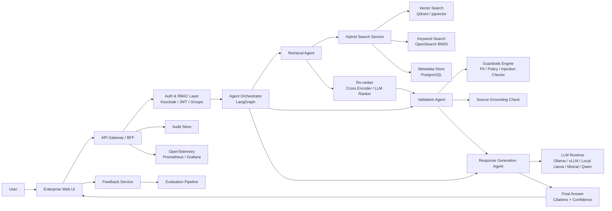
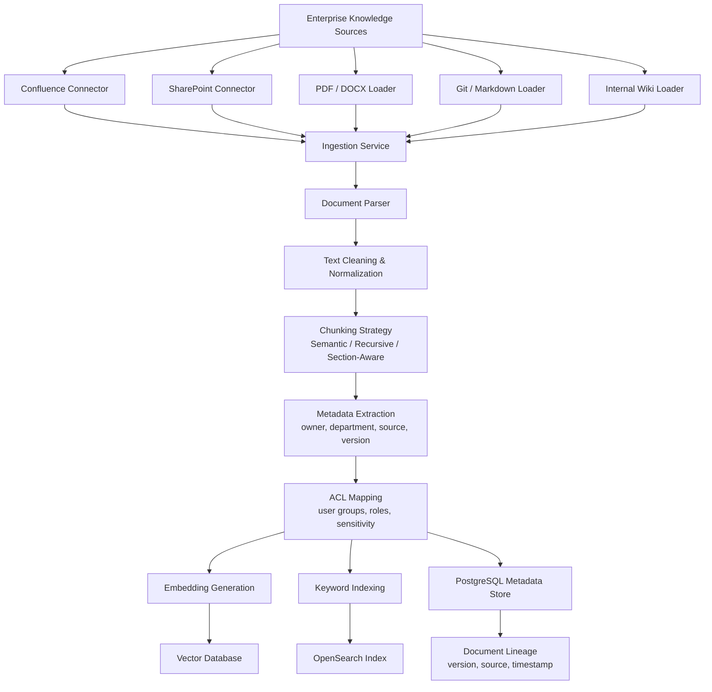
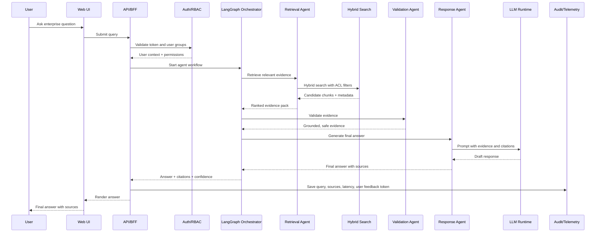
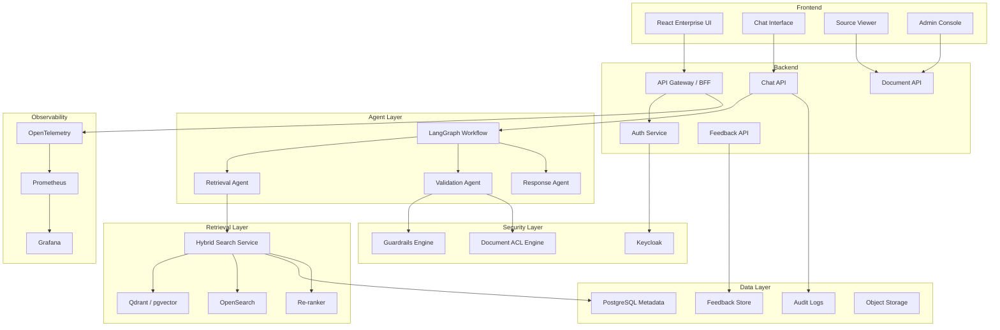
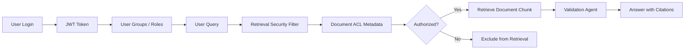
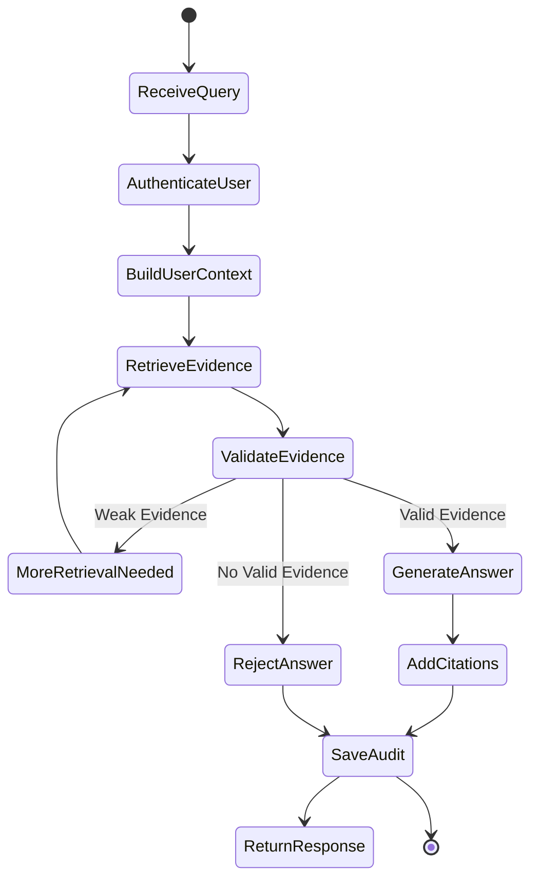
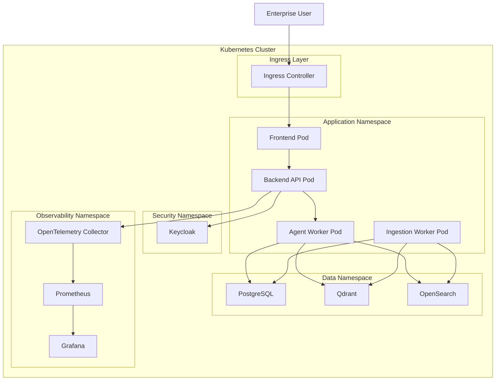

# Multi-Agent Enterprise Knowledge Assistant

> Enterprise-grade open-source AI knowledge assistant for secure internal document search, policy Q&A, SOP discovery, and source-grounded responses using Multi-Agent RAG architecture.

---

## 1. Project Overview

The **Multi-Agent Enterprise Knowledge Assistant** is an enterprise-style AI platform designed to help employees search and reason across internal knowledge sources such as:

* Policies
* SOPs
* Confluence pages
* SharePoint documents
* PDFs
* Runbooks
* Architecture documents
* Operational procedures
* Internal engineering documentation

Instead of manually searching across multiple systems, users can ask a natural language question and receive a **source-cited, access-controlled, validated answer**.

This project is built as a learning-focused but enterprise-aligned implementation of:

* Agentic AI
* Enterprise RAG
* Hybrid Search
* Secure Knowledge Retrieval
* Source-grounded Answer Generation
* RBAC-aware Retrieval
* Guardrailed AI Responses
* Auditability and Observability

---

## 2. Problem Statement

In large enterprises, employees spend significant time searching across disconnected documentation systems.

Common challenges include:

* Documents scattered across Confluence, SharePoint, PDFs, wikis, and internal portals
* Keyword search returning too many irrelevant results
* Lack of trusted answers with citations
* Risk of exposing restricted documents to unauthorized users
* No consistent answer validation
* No audit trail for AI-generated responses
* No feedback loop to improve answer quality

This project solves the problem using a **multi-agent architecture** where each agent has a clear responsibility.

---

## 3. Architecture Goals

The system is designed around the following enterprise architecture goals:

| Goal                  | Description                                                     |
| --------------------- | --------------------------------------------------------------- |
| Secure Retrieval      | Users can only retrieve documents they are authorized to access |
| Source Grounding      | Every answer must be backed by retrieved enterprise sources     |
| Hybrid Search         | Combines semantic vector search with BM25 keyword search        |
| Multi-Agent Reasoning | Retrieval, validation, and response generation are separated    |
| Explainability        | Final answers include citations, confidence, and evidence       |
| Observability         | Every request is traced, logged, and measurable                 |
| Feedback Loop         | Users can rate responses to improve retrieval and evaluation    |
| Open-Source First     | Uses open-source technologies wherever possible                 |

---

## 4. High-Level Architecture



---

## 5. Enterprise Ingestion Architecture

The assistant is only as good as the indexed enterprise knowledge.
This project includes a dedicated ingestion pipeline for loading, parsing, chunking, securing, and indexing documents.



---

## 6. Runtime Query Flow



---

## 7. Multi-Agent Design

The architecture uses specialized agents instead of a single monolithic prompt.

### 7.1 Retrieval Agent

The Retrieval Agent is responsible for finding the most relevant enterprise knowledge.

Responsibilities:

* Understand user intent
* Rewrite or expand the query if required
* Run hybrid search
* Apply ACL and metadata filters
* Retrieve candidate chunks
* Re-rank evidence
* Return a structured evidence pack

Example output:

```json
{
  "query": "What is the approval process for production deployment?",
  "evidence": [
    {
      "documentId": "sop-prod-release-001",
      "title": "Production Deployment SOP",
      "chunk": "All production releases require maker-checker approval...",
      "source": "Confluence",
      "score": 0.91,
      "allowedGroups": ["ENGINEERING", "RELEASE_MANAGER"]
    }
  ]
}
```

---

### 7.2 Validation Agent

The Validation Agent ensures that the retrieved evidence is safe and usable.

Responsibilities:

* Check whether the answer can be grounded in the retrieved sources
* Detect missing evidence
* Detect contradictory sources
* Apply policy guardrails
* Detect prompt injection attempts
* Mask sensitive information if required
* Reject unsupported answers

Validation outcomes:

| Outcome           | Meaning                        |
| ----------------- | ------------------------------ |
| PASS              | Evidence is sufficient         |
| PARTIAL           | Evidence is weak or incomplete |
| FAIL              | Answer should not be generated |
| NEED_MORE_CONTEXT | More retrieval is required     |

---

### 7.3 Response Agent

The Response Agent generates the final answer.

Responsibilities:

* Generate clear enterprise-style response
* Use only validated evidence
* Add source citations
* Add confidence score
* Avoid unsupported claims
* Provide next steps when applicable

Example response structure:

```json
{
  "answer": "Production deployments require approval from both the maker and checker before execution.",
  "citations": [
    {
      "title": "Production Deployment SOP",
      "source": "Confluence",
      "section": "Approval Workflow"
    }
  ],
  "confidence": "HIGH"
}
```

---

## 8. Recommended Open-Source Tech Stack

| Layer               | Technology                          |
| ------------------- | ----------------------------------- |
| Frontend            | React, Vite, TypeScript             |
| Backend API         | FastAPI or Spring Boot              |
| Agent Orchestration | LangGraph                           |
| RAG Framework       | LlamaIndex or LangChain             |
| LLM Runtime         | Ollama, vLLM, llama.cpp             |
| Open Models         | Llama, Mistral, Qwen                |
| Embeddings          | BGE, E5, Nomic Embeddings           |
| Vector Database     | Qdrant or pgvector                  |
| Keyword Search      | OpenSearch                          |
| Metadata Store      | PostgreSQL                          |
| Authentication      | Keycloak                            |
| Authorization       | RBAC + document-level ACL           |
| Guardrails          | NeMo Guardrails + custom validators |
| Observability       | OpenTelemetry, Prometheus, Grafana  |
| Evaluation          | RAGAS, DeepEval, golden Q&A dataset |
| Deployment          | Docker, Kubernetes                  |
| CI/CD               | GitHub Actions / Jenkins            |

---

## 9. Logical Component Architecture



---

## 10. Security Architecture

Enterprise RAG must be secure by design.

This project applies security at multiple levels:



Security controls:

* JWT-based authentication
* Role-based access control
* Document-level ACL filtering
* Tenant-aware metadata filtering
* Sensitive document classification
* Prompt injection detection
* PII masking
* Audit trail for every query
* No answer generation from unauthorized sources

---

## 11. Data Model

### 11.1 Document Metadata

```sql
CREATE TABLE document_metadata (
    document_id UUID PRIMARY KEY,
    title VARCHAR(500) NOT NULL,
    source_system VARCHAR(100) NOT NULL,
    source_url TEXT,
    department VARCHAR(100),
    owner VARCHAR(255),
    classification VARCHAR(50),
    version VARCHAR(50),
    checksum VARCHAR(255),
    indexed_at TIMESTAMP NOT NULL,
    created_at TIMESTAMP DEFAULT CURRENT_TIMESTAMP,
    updated_at TIMESTAMP DEFAULT CURRENT_TIMESTAMP
);
```

---

### 11.2 Document Access Control

```sql
CREATE TABLE document_acl (
    id UUID PRIMARY KEY,
    document_id UUID NOT NULL,
    allowed_group VARCHAR(255) NOT NULL,
    permission VARCHAR(50) NOT NULL,
    created_at TIMESTAMP DEFAULT CURRENT_TIMESTAMP,
    CONSTRAINT fk_document_acl_document
        FOREIGN KEY (document_id)
        REFERENCES document_metadata(document_id)
);
```

---

### 11.3 Query Audit

```sql
CREATE TABLE query_audit (
    audit_id UUID PRIMARY KEY,
    user_id VARCHAR(255) NOT NULL,
    query_text TEXT NOT NULL,
    response_status VARCHAR(50),
    confidence_score NUMERIC(5,2),
    latency_ms BIGINT,
    sources_used JSONB,
    created_at TIMESTAMP DEFAULT CURRENT_TIMESTAMP
);
```

---

### 11.4 Feedback

```sql
CREATE TABLE answer_feedback (
    feedback_id UUID PRIMARY KEY,
    audit_id UUID NOT NULL,
    rating INT,
    feedback_text TEXT,
    is_helpful BOOLEAN,
    created_at TIMESTAMP DEFAULT CURRENT_TIMESTAMP,
    CONSTRAINT fk_feedback_audit
        FOREIGN KEY (audit_id)
        REFERENCES query_audit(audit_id)
);
```

---

## 12. Suggested Repository Structure

```text
multi-agent-enterprise-knowledge-assistant/
│
├── README.md
├── docker-compose.yml
├── .env.example
├── Makefile
│
├── docs/
│   ├── architecture.md
│   ├── ingestion-design.md
│   ├── security-model.md
│   ├── evaluation-strategy.md
│   └── api-contracts.md
│
├── backend/
│   ├── app/
│   │   ├── main.py
│   │   ├── api/
│   │   │   ├── chat_controller.py
│   │   │   ├── document_controller.py
│   │   │   └── feedback_controller.py
│   │   ├── agents/
│   │   │   ├── retrieval_agent.py
│   │   │   ├── validation_agent.py
│   │   │   ├── response_agent.py
│   │   │   └── graph.py
│   │   ├── ingestion/
│   │   │   ├── document_loader.py
│   │   │   ├── parser.py
│   │   │   ├── chunker.py
│   │   │   ├── metadata_extractor.py
│   │   │   └── indexer.py
│   │   ├── retrieval/
│   │   │   ├── hybrid_search.py
│   │   │   ├── vector_search.py
│   │   │   ├── keyword_search.py
│   │   │   └── reranker.py
│   │   ├── security/
│   │   │   ├── auth_context.py
│   │   │   ├── rbac.py
│   │   │   ├── acl_filter.py
│   │   │   └── guardrails.py
│   │   ├── observability/
│   │   │   ├── tracing.py
│   │   │   ├── metrics.py
│   │   │   └── logging.py
│   │   ├── persistence/
│   │   │   ├── postgres.py
│   │   │   ├── audit_repository.py
│   │   │   └── feedback_repository.py
│   │   └── config/
│   │       └── settings.py
│   │
│   ├── tests/
│   └── requirements.txt
│
├── frontend/
│   ├── src/
│   │   ├── components/
│   │   ├── pages/
│   │   ├── services/
│   │   ├── auth/
│   │   └── App.tsx
│   ├── package.json
│   └── vite.config.ts
│
├── infrastructure/
│   ├── docker/
│   ├── kubernetes/
│   ├── grafana/
│   ├── prometheus/
│   └── keycloak/
│
├── eval/
│   ├── golden_dataset.json
│   ├── ragas_eval.py
│   └── deepeval_tests.py
│
└── scripts/
    ├── ingest_documents.py
    ├── create_indexes.py
    └── seed_demo_data.py
```

---

## 13. Core API Endpoints

| Method | Endpoint                   | Description                   |
| ------ | -------------------------- | ----------------------------- |
| POST   | `/api/v1/chat/query`       | Submit a user question        |
| GET    | `/api/v1/chat/history`     | Retrieve conversation history |
| POST   | `/api/v1/documents/ingest` | Ingest documents              |
| GET    | `/api/v1/documents/{id}`   | Retrieve document metadata    |
| POST   | `/api/v1/feedback`         | Submit answer feedback        |
| GET    | `/api/v1/admin/audit`      | View query audit trail        |
| GET    | `/api/v1/admin/metrics`    | View system metrics           |

---

## 14. Example Chat Request

```json
{
  "query": "What is the approval process for production deployment?",
  "conversationId": "conv-123",
  "userContext": {
    "userId": "john.doe",
    "groups": ["ENGINEERING", "RELEASE_MANAGER"]
  }
}
```

---

## 15. Example Chat Response

```json
{
  "answer": "Production deployments require maker-checker approval before execution. The release owner submits the deployment request, the checker validates the change details, and only approved changes are eligible for execution.",
  "confidence": "HIGH",
  "citations": [
    {
      "documentTitle": "Production Deployment SOP",
      "sourceSystem": "Confluence",
      "section": "Approval Workflow",
      "documentId": "sop-prod-release-001"
    }
  ],
  "metadata": {
    "retrievalStrategy": "HYBRID_SEARCH",
    "documentsRetrieved": 7,
    "documentsUsed": 2,
    "latencyMs": 1842
  }
}
```

---

## 16. Local Development Setup

### 16.1 Prerequisites

Install:

* Docker
* Python 3.11+
* Node.js 20+
* PostgreSQL client
* Git

Optional:

* Ollama
* kubectl
* Helm

---

### 16.2 Start Infrastructure

```bash
docker compose up -d
```

This starts:

* PostgreSQL
* Qdrant
* OpenSearch
* Keycloak
* Prometheus
* Grafana

---

### 16.3 Start Backend

```bash
cd backend
python -m venv .venv
source .venv/bin/activate

pip install -r requirements.txt

uvicorn app.main:app --reload --port 8080
```

---

### 16.4 Start Frontend

```bash
cd frontend
npm install
npm run dev
```

Frontend runs at:

```text
http://localhost:5173
```

Backend runs at:

```text
http://localhost:8080
```

---

## 17. Docker Compose Example

```yaml
version: "3.9"

services:
  postgres:
    image: postgres:16
    container_name: mea-postgres
    environment:
      POSTGRES_DB: knowledge_assistant
      POSTGRES_USER: admin
      POSTGRES_PASSWORD: admin
    ports:
      - "5432:5432"

  qdrant:
    image: qdrant/qdrant:latest
    container_name: mea-qdrant
    ports:
      - "6333:6333"

  opensearch:
    image: opensearchproject/opensearch:latest
    container_name: mea-opensearch
    environment:
      discovery.type: single-node
      plugins.security.disabled: "true"
      OPENSEARCH_INITIAL_ADMIN_PASSWORD: "Admin123!"
    ports:
      - "9200:9200"

  keycloak:
    image: quay.io/keycloak/keycloak:latest
    container_name: mea-keycloak
    command: start-dev
    environment:
      KEYCLOAK_ADMIN: admin
      KEYCLOAK_ADMIN_PASSWORD: admin
    ports:
      - "8081:8080"

  prometheus:
    image: prom/prometheus:latest
    container_name: mea-prometheus
    ports:
      - "9090:9090"

  grafana:
    image: grafana/grafana:latest
    container_name: mea-grafana
    ports:
      - "3000:3000"
```

---

## 18. Enterprise Features

### 18.1 Hybrid Search

The system uses both:

* **Vector Search** for semantic similarity
* **BM25 Search** for exact keyword matching

This improves retrieval quality for enterprise documents where users may search by:

* policy name
* ticket ID
* SOP title
* error code
* business term
* technical term
* acronym

---

### 18.2 Source Citation

Every final answer includes citations.

Citation metadata includes:

* document title
* source system
* section
* page number if available
* chunk ID
* document URL if available

---

### 18.3 Role-Based Access Control

Documents are filtered based on user identity and groups.

Example:

```text
User Groups:
- ENGINEERING
- RELEASE_MANAGER

Document ACL:
- ENGINEERING
- PLATFORM_ADMIN

Result:
User can access the document because ENGINEERING matches.
```

Unauthorized documents are excluded before the LLM receives context.

---

### 18.4 Guardrails

Guardrails protect the assistant from unsafe or unsupported behavior.

Examples:

* Do not answer without evidence
* Do not reveal restricted documents
* Do not expose PII
* Do not follow malicious prompt instructions from documents
* Do not hallucinate policy details
* Ask for clarification when the question is ambiguous
* Escalate to human owner for high-risk responses

---

### 18.5 Observability

Every query captures:

* trace ID
* user ID
* latency
* token usage
* retrieved document IDs
* validation result
* confidence score
* model name
* feedback rating
* error details

Observability stack:

```text
Application Logs → OpenTelemetry → Prometheus → Grafana
```

---

### 18.6 Evaluation

The evaluation pipeline measures:

| Metric             | Description                                    |
| ------------------ | ---------------------------------------------- |
| Faithfulness       | Whether the answer is supported by the context |
| Answer Relevance   | Whether the response answers the user question |
| Context Precision  | Whether retrieved chunks are relevant          |
| Context Recall     | Whether important evidence was retrieved       |
| Citation Accuracy  | Whether citations match the generated answer   |
| Hallucination Rate | Whether unsupported facts were generated       |

Tools:

* RAGAS
* DeepEval
* Golden Q&A dataset
* Human feedback review

---

## 19. Agent Workflow



---

## 20. Deployment Architecture



---

## 21. Implementation Roadmap

### Phase 1: Foundation

* Create backend API
* Create frontend chat UI
* Add PostgreSQL metadata schema
* Add document upload API
* Add basic chunking
* Add Qdrant vector indexing
* Add basic semantic search
* Add local LLM integration through Ollama

---

### Phase 2: Enterprise Retrieval

* Add OpenSearch BM25 indexing
* Implement hybrid retrieval
* Add re-ranking
* Add source citation
* Add metadata filters
* Add document-level ACL filtering

---

### Phase 3: Multi-Agent Workflow

* Add LangGraph orchestrator
* Implement Retrieval Agent
* Implement Validation Agent
* Implement Response Agent
* Add structured evidence packs
* Add confidence scoring

---

### Phase 4: Security and Governance

* Add Keycloak authentication
* Add RBAC
* Add document classification
* Add PII masking
* Add prompt injection detection
* Add audit logging

---

### Phase 5: Observability and Evaluation

* Add OpenTelemetry tracing
* Add Prometheus metrics
* Add Grafana dashboards
* Add feedback collection
* Add RAGAS evaluation
* Add DeepEval tests
* Add golden Q&A dataset

---

### Phase 6: Production Hardening

* Add Kubernetes manifests
* Add Helm chart
* Add CI/CD pipeline
* Add integration tests
* Add load testing
* Add disaster recovery documentation
* Add backup and restore strategy

---

## 22. Enterprise Quality Checklist

| Area           | Requirement                 | Status  |
| -------------- | --------------------------- | ------- |
| Authentication | Keycloak JWT login          | Planned |
| Authorization  | RBAC and document ACL       | Planned |
| Retrieval      | Hybrid search               | Planned |
| Validation     | Source-grounding validation | Planned |
| Citations      | Source-level citations      | Planned |
| Audit          | Query audit trail           | Planned |
| Observability  | Metrics and tracing         | Planned |
| Evaluation     | RAG quality testing         | Planned |
| Deployment     | Docker and Kubernetes       | Planned |
| Security       | Guardrails and PII masking  | Planned |

---

## 23. Resume Impact

This project demonstrates:

* Enterprise RAG architecture
* Multi-agent AI workflow design
* Secure document retrieval
* Hybrid vector and keyword search
* Source-grounded answer generation
* RBAC-aware AI systems
* Open-source LLM integration
* Production observability
* Kubernetes deployment readiness
* AI evaluation and feedback loops

Suggested resume bullet:

> Designed and implemented an enterprise-grade Multi-Agent Knowledge Assistant using LangGraph, hybrid RAG, Qdrant, OpenSearch, PostgreSQL, Keycloak, and open-source LLMs to deliver secure, source-cited answers across internal documents with RBAC, guardrails, observability, and evaluation workflows.

---

## 24. Example Use Cases

| Use Case            | Example Question                                                      |
| ------------------- | --------------------------------------------------------------------- |
| HR Policy Search    | “What is the parental leave policy?”                                  |
| Engineering SOP     | “How do I deploy a service to production?”                            |
| Incident Response   | “What is the escalation process for a P1 incident?”                   |
| Architecture Review | “What is the approved pattern for service-to-service authentication?” |
| Compliance          | “What controls are required for sensitive data access?”               |
| Onboarding          | “Where can I find the new joiner checklist?”                          |

---

## 25. Future Enhancements

* Multi-tenant support
* Department-specific knowledge spaces
* Admin document governance UI
* Document freshness scoring
* Human approval for sensitive answers
* Real-time connector sync
* Fine-grained policy engine using OPA
* Model routing based on query complexity
* Cost and token budget controls
* Offline batch evaluation dashboard
* Knowledge graph integration
* Workflow automation agent
* Slack / Teams integration

---

## 26. Project Vision

The long-term vision is to build an enterprise-ready AI knowledge layer that can securely answer employee questions across internal documentation while preserving governance, explainability, and trust.

This is not just a chatbot.

It is a secure, observable, source-grounded, multi-agent enterprise knowledge platform.

---

## 27. License

This project is intended for learning and portfolio use.

Recommended license:

```text
Apache License 2.0
```

---

## 28. Author

Built as an enterprise AI architecture study project focused on:

* Agentic AI
* Enterprise RAG
* Open-source LLM systems
* Secure knowledge retrieval
* Production-grade AI platform design
